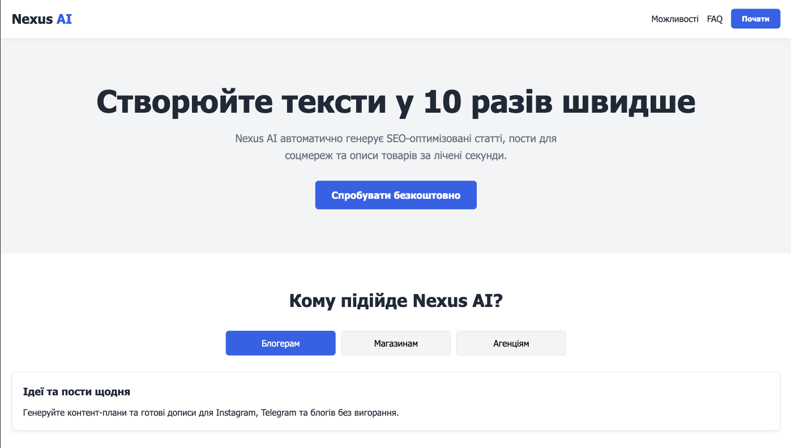

# Nexus AI - Landing Page

A modern, responsive landing page for an AI service, built using a classic tech stack (HTML5, CSS3, jQuery). The project is developed following a **Mobile-First** approach, with a focus on clean semantics and smooth user interaction.

🔗 **[View Live Demo](https://yuriidaniuk.github.io/Simple-landing/)**

## 📸  Screenshots

### PC view


### Mobile view


## 🛠 Technologies

- **HTML5:** Semantic markup, accessibility.
- **CSS3:** Custom variables (CSS Variables), Flexbox, responsive design (Media Queries), smooth transitions.
- **jQuery:** DOM manipulation, event handling, animations (fadeIn/fadeOut, slideUp/slideDown).

## ✨ Features & Interactivity

All logic is written from scratch without relying on heavy UI frameworks:

1. **Smooth Scroll:** Seamless page navigation with automatic offset calculation for the fixed header.
2. **Modal Window (Pop-up):** Opens on button click and closes correctly upon clicking the close button or the dark overlay (accounting for event bubbling).
3. **Tabs:** Dynamic content switching in the features section using `data` attributes to link buttons and content blocks.
4. **Accordion (FAQ):** Optimized Q&A list where opening a new tab automatically and smoothly collapses the previously opened ones.

## 🚀 How to Run Locally

The project does not require complex environment setup or build tools.

1. Clone the repository:
   ```bash
   git clone https://github.com/yuriiDaniuk/Simple-landing.git

2. Open the project folder.

3. Open the index.html file in any modern browser (or use an extension like Live Server in VS Code).